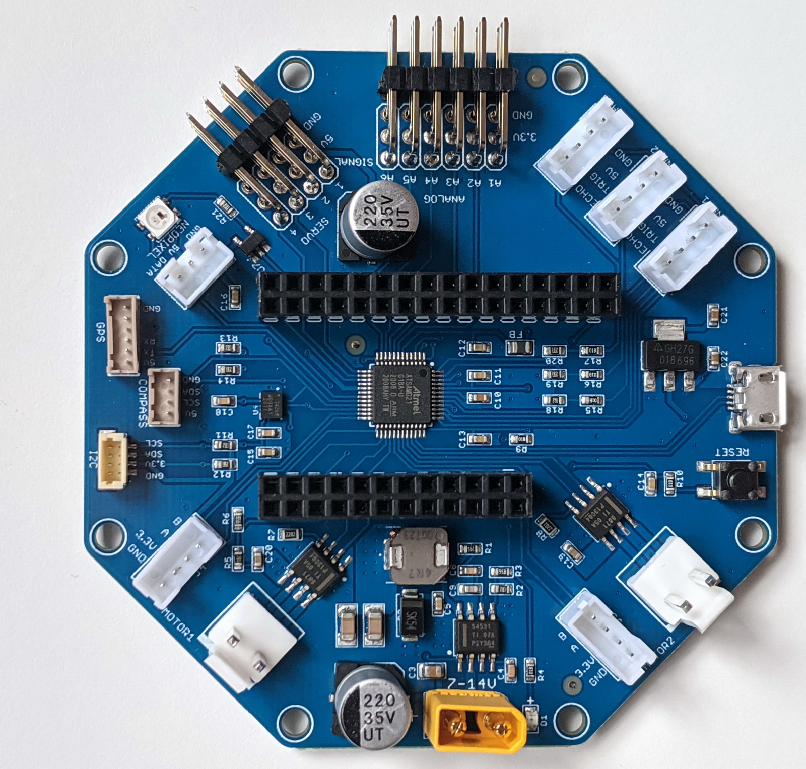

=========================
RoverWing Arduino Library
=========================

    RoverWing (without the Feather), top view.

RoverWing is an extension board  (or "wing", following Adafruit's terminology) for
Adafruit's `Feather boards <https://www.adafruit.com/feather>`__.
This extension board  provides motor drivers, Inertial Motion Unit (IMU), and connection
ports for servos, sonars, GPS, and other peripherals commonly used by small
mobile robots. It also contains a microcontroller preloaded with firmware
to control these peripherals, which communicates with the Feather board using
I2C protocol, thus freeing resources of the Feather board for other purposes.

To find more information about RoverWing, please visit
|guide|.

To use RoverWing, you need to install the RoverWing Arduino library,
which can be downloaded from http://github.com/roverwing/RoverWingLibrary.
This library is intended for use with Arduino IDE (version 1.6.2 or later).
This user guide describes the features of the library.

.. toctree::
    :caption: Table of Contents
    :maxdepth: 1

    installation
    basic
    imu
    pid
    top
    license
