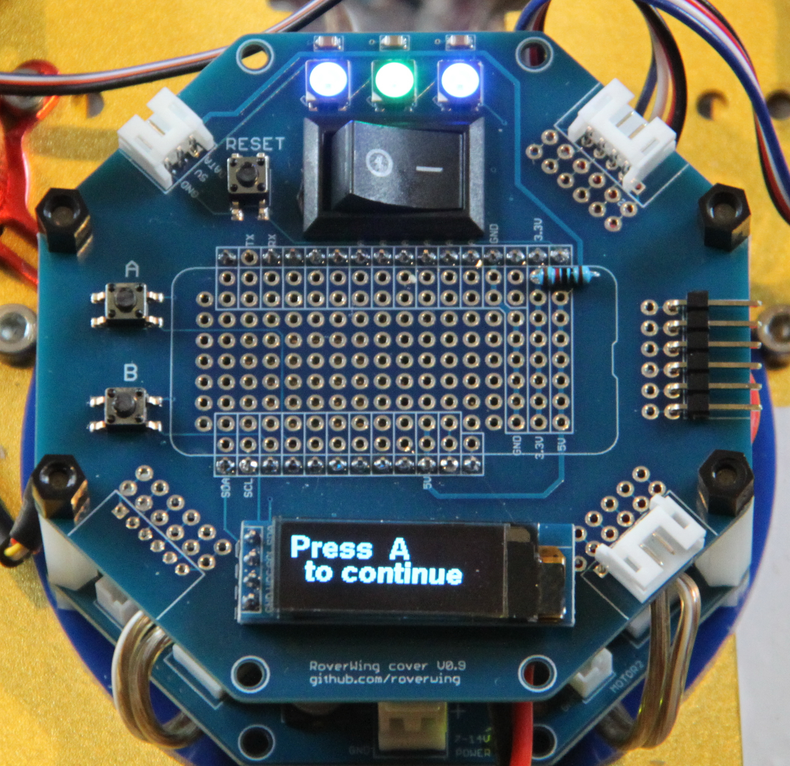

===================
Using RoverWing Top
===================

RoverWing top is an optional accessory to RoverWing, which includes
a small prototyping area, on/off switch, three NeoPixel LEDs and two buttons,
and a 3-line display. It is described in detail in |guide|. A photo of the
RoverWing with the top attached is shown below.

    RoverWing board with the top attached.

RoverWing library includes some functions for use with the RoverWing top. To
use these functions, you need to have the graphics library
`U8G2 <https://github.com/olikraus/u8g2/>`__ installed; you can do it easily by
using Arduino IDE library manager.

RoverWing library includes a sample sketch illustrating the use of RoverWing top;
this sketch can be found under :menuselection:`File-->Examples-->RoverWing-->TopCover`.

Initialization
--------------
The sample code below shows basic  initialization necessary to use RoverWing top::

    #include <Wire.h>
    #include <RoverWing.h>
    #include <RoverWingTop.h> //library for use with the top display and buttons
    #define BUTTON_A 5
    #define BUTTON_B 6

    Rover r; //this is the name of the rover!
    void setup(){
        pinMode(BUTTON_A, INPUT_PULLUP);
        pinMode(BUTTON_B, INPUT_PULLUP);
        Wire.begin();
        Wire.setClock(400000); //use fast mode (400 kHz)
        // declare the NeoPixels
        r.setPixelCount(3);
        //initialize the top display
        topDisplay.begin();
        topDisplay.clearBuffer();
        //connect to RoverWing
        r.beginVerbose();
    }

Note that there is no need to include ``U8G2`` library, as it is included by
:file:`RoverWing.h`.

Buttons
-------

RoverWing top contains two buttons, labelled :guilabel:`Button A` and
:guilabel:`Button B`. These buttons are connected to two pins of the Feather
board: button A is connected to the pin next to SCL, and button B, to the next
pin. Unfortunately, pin numbers assigned to this pins depend on which Feather
board you are using; for this reason, you need to include the definitions in
your sketch, as illustrated above.

For Feather boards based on Cortex M0, Atmega 328P, or 32u4 chipsets, the pin
numbers are 5 (button A) and 6 (button B).
For HUZZAH32-ESP32 Feather, these are pin numbers 14 (button A) and 32 (button B).

.. figure:: images/feather-bluefruit.jpg
    :alt: Feather Bluefruit
    :width: 60%

    Adafruit Bluefruit Feather, based on M0 chip, top view. Buttons A and B of
    RoverWing top are connected to  pins  5 and 6 respectively.

.. note::
   Instead of ``BUTTON_A`` and ``BUTTON_B``, you can define  your own names for
   buttons.

Pins connected to buttons  are normally HIGH; pressing the button pulls it LOW.
You can read the  pin values in the usual way, using ``digitalRead(BUTTON_A)``;
in addition, you can also use the ``waitForButton()`` function below.

.. function:: void waitForButton(uint8_t button)

   Pauses execution of the program until the button is pressed.

   :param uint8_t button: button to be pressed. Can be a pin number or a
       defined constant such as ``BUTTON_A``.

LEDs
----

RoverWing top contains three NeoPixel LEDs, which are connected to the NeoPixel
output port of RoverWing and can be controlled using functions described in
:ref:`neopixel` section.  These LEDs have indices 1 through 3 (right to left). For
example, to turn the middle LED red and the two outer green, you can use
::

    r.setPixelBrightness(64); //1/4 of full brightness - this is already quite bright
    r.setPixelColor(1,GREEN);
    r.setPixelColor(2,RED);
    r.setPixelColor(3,GREEN);
    r.showPixel();

RoverWing top also contains additional NeoPixel port, allowing one to connect
additional NeoPixel strips. In this case, the indices of these NeoPixels will
start with 4, and the number of NeoPixels which you set using
``setPixelCount()`` must include  the three NeoPixels of the RoverWing Top and
the externally connected NeoPixels. 

.. warning::

   If you use RoverWing top, do not connect NeoPixels to the NeoPixel port of
   the RoverWing board itself --- instead, use the port on the top.

Graphic Display
---------------

RoverWing contains a small (0.91 inch) monochrome OLED graphic display based
on SSD1306 chipset. This display has 128*32 resolution - enough for up to 3
lines of text (you could try and put 4 lines, but it would be barely readable).
It is connected directly  to the SDA and SCL pins of Feather board and you can
use a library of your choice to control it. RoverWing expects that you have
installed `U8G2 <https://github.com/olikraus/u8g2/>`__ library and creates an
object ``topDisplay`` of class ``U8G2_SSD1306_128X32_UNIVISION_F_HW_I2C``.
You can use any functions defined by ``U8G2`` graphics library (see
`U8G2 User Guide <https://github.com/olikraus/u8g2/wiki>`__). In particular,
the following functions are most useful.

.. function:: topDisplay.begin()

   Initializes the display.

.. function::   topDisplay.clearBuffer()

   Clears the display, erasing all contents.

In addition, the following functions are defined in :file:`RoverWing.h`. Note
that these functions are global - they do not belong to any class.

.. function:: void displayMessage(String line1)

.. function:: void displayMessage(String line1, String line2)

.. function:: void displayMessage(String line1, String Lien2, String line3)

   Output  one, two, or three lines on the top display. This function uses
   the same font for 1- and 2- line messages, and a different, slightly
   smaller, font  for 3-line messages.

You can change the fonts used for messages by adding in the beginning of your
sketch the following lines::

    #define TWO_LINE_FONT u8g2_font_helvB14_tr
    #define THREE_LINE_FONT u8g2_font_7x13B_tr

replacing the font names by a font of your choice from the list of fonts
included with ``U8G2`` library; full list can be found
`here <https://github.com/olikraus/u8g2/wiki/fntlistall>`__.

.. warning::

   The font definitions must appear in your sketch **before** the line
   ``#include <RoverWingTop.h>``.
